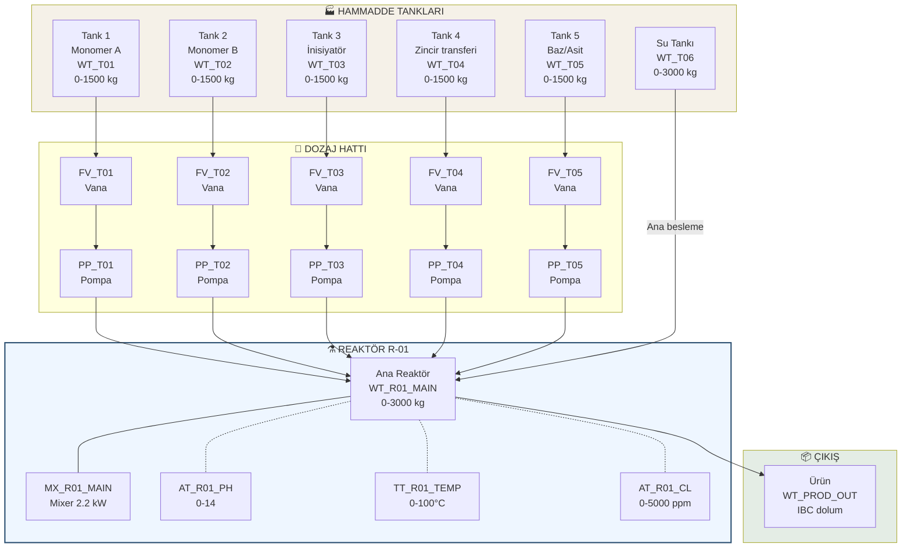
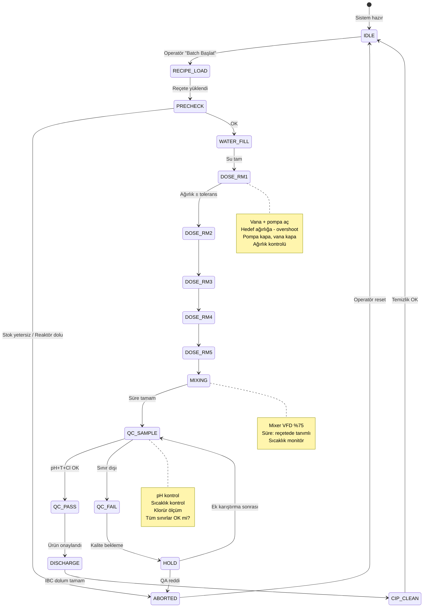

# P&ID ve Proses Sekans — MAPA Katkı Dozaj Hattı

## 1. Fiziksel Akış Diyagramı (P&ID Basitleştirilmiş)



---

## 2. Batch Sekans Durum Diyagramı



---

## 3. Reçete Veri Yapısı

Her katkı ürünü için bir reçete = 5 hammaddenin oranı + karışım süresi + hedef kalite.

### 3.1 Reçete DB (PLC tarafı)

```
Recipe:
  code             : STRING[20]        // Ör. "ADX-100-v3"
  batch_target_kg  : REAL              // Ör. 1000.0 (batch başına)
  water_kg         : REAL              // Su miktarı
  rm1_kg           : REAL              // RM1 dozajı
  rm2_kg           : REAL              // RM2 dozajı
  rm3_kg           : REAL              // RM3 dozajı
  rm4_kg           : REAL              // RM4 dozajı
  rm5_kg           : REAL              // RM5 dozajı
  tolerance_pct    : REAL              // Ör. 0.5 (%)
  mix_time_sec     : INT               // Ör. 1800 (30 dk)
  mix_speed_pct    : INT               // Ör. 75 (VFD)
  target_ph_min    : REAL              // Ör. 4.5
  target_ph_max    : REAL              // Ör. 7.0
  target_temp_max  : REAL              // Ör. 45.0 °C
  target_cl_max    : REAL              // Ör. 800 ppm (BR-QA-05)
```

### 3.2 Örnek reçete (ADX-100 superplastifiyan)

| Alan | Değer |
|------|-------|
| `code` | `ADX-100-v3` |
| `batch_target_kg` | 1000.0 kg |
| `water_kg` | 600.0 kg |
| `rm1_kg` | 250.0 kg (Monomer A / PEG) |
| `rm2_kg` | 80.0 kg (Monomer B / Acrylic acid) |
| `rm3_kg` | 15.0 kg (İnisiyatör / Persulfat) |
| `rm4_kg` | 8.0 kg (Zincir transferi / mercaptan) |
| `rm5_kg` | 47.0 kg (NaOH nötralizasyon) |
| `tolerance_pct` | 0.5 % |
| `mix_time_sec` | 1800 sn (30 dk) |
| `mix_speed_pct` | 75 % |
| `target_ph_min` | 4.5 |
| `target_ph_max` | 7.0 |
| `target_temp_max` | 45 °C |
| `target_cl_max` | 800 ppm |

**Toplam kontrol:** 600 + 250 + 80 + 15 + 8 + 47 = 1000 kg ✓

---

## 4. Dozajlama Algoritması (İki Aşamalı — Coarse + Fine)

Endüstriyel dozajlama için standart yaklaşım:

```
Hedef ağırlık: Target = W_current + RM_dose_kg
Coarse limit:  Coarse_stop = Target - Overshoot
   Overshoot = Pompa kapanışından sonra düşecek miktar (~2-5 kg)
Fine limit:    Fine_stop = Target (± tolerance)

Adım 1 [COARSE]: Pompa hızlı akış (%100)
   Ağırlık ≥ Coarse_stop → hıza düş
Adım 2 [FINE]:   Pompa yavaş akış (%20-30)
   Ağırlık ≥ Fine_stop → pompa kapat, vana kapat
Adım 3 [SETTLE]: 5 sn bekle (sıvı durulsun)
Adım 4 [VERIFY]: Ölçülen değer içinde mi?
   |Actual - Target| ≤ tolerance → OK
   Aksi halde → ALARM + DEVIATION_LOG
```

**Alternatif — pompa AN/OF ise (Grundfos DDA):**
- Pompa strokes count ile dozaj (litre bazlı) + load cell ile teyit

---

## 5. Emniyet Interlock Matrisi

Hangi durumda hangi çıkış BLOKLANIR:

| Koşul | FV vanalar | Pompalar | Mixer | Not |
|-------|-----------|----------|-------|-----|
| `HS_PANEL_ESTOP` basıldı | ❌ hepsi | ❌ hepsi | ❌ | Manuel reset gerek |
| `WT_R01_MAIN` > 2950 kg (HH) | ❌ hepsi | ❌ hepsi | — | Reaktör dolu |
| `TT_R01_TEMP` > 60 °C (HH) | ❌ hepsi | ❌ hepsi | ❌ | Termal alarm |
| `AT_R01_PH` sınır dışı | — | — | — | Sadece alarm, QC HOLD |
| Load cell arıza (fault) | ❌ ilgili tank | ❌ ilgili pompa | — | Sensör alarmı |
| Vana pozisyon geri besleme yok (2 sn) | ❌ ilgili vana | ❌ ilgili pompa | — | Vana arıza |
| PLC-HMI iletişim koptu | ❌ hepsi | ❌ hepsi | ❌ | Fail-safe |

---

## 6. Alarm Kategorileri

| Kategori | Renk | Reset? | Örnek |
|----------|------|--------|-------|
| **CRITICAL** | Kırmızı + korna | Manuel | E-Stop, HH sıcaklık, HH ağırlık |
| **WARNING** | Sarı | Otomatik (sebep düzelince) | pH out of range, düşük stok |
| **INFO** | Yeşil | Otomatik | Batch tamamlandı, reçete yüklendi |

Alarm log format:
```
YYYY-MM-DD HH:MM:SS.mmm | LEVEL | TAG | VALUE | MESSAGE
2026-09-15 14:23:07.123 | CRITICAL | WT_R01_MAIN | 2967.5 | HH weight alarm
```

---

## 7. Sonraki Adım

- **03_plc_iskelet.md**: TIA Portal proje yapısı, DB tanımları, ana FB/FC listesi
- **PLC/SCL kaynak dosyaları**: `plc/src/` altında
- **Node-RED dashboard mockup**: `scada/flows.json`
